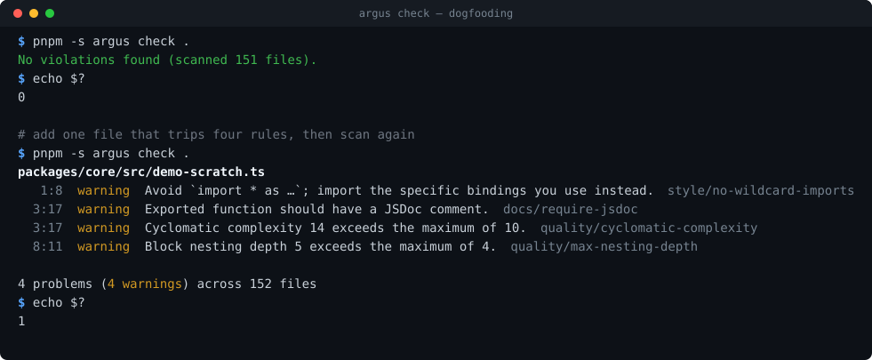

# Argus

**Argus is a deterministic, architecture-aware code-quality scanner for TypeScript monorepos.** It parses your source with tree-sitter, applies explicit rules to the syntax tree, and reports exactly what it found — as readable console output or as a schema-validated JSON document for CI.

- **No model in the scan path.** Same commit in, same findings out — every time. Rule results are sorted by a total order and re-serialise byte-identically, so a diff in CI means your code changed, not that the weather did.
- **Architecture is enforced, not documented.** "The domain core may not import an adapter", "no package may reach into another's internals", "`packages/` may not import `apps/`" are dependency-cruiser rules that fail the build — and each one was negative-tested: deliberately violated to prove it actually fires, then reverted.
- **Built by AI agents, under gates that don't take their word for it.** Every task is one branch and one PR; a second agent reviews the diff — from a different model family wherever the roster allows, because a same-model reviewer rationalises past what an independent one catches — and CI fails the PR if that review is missing. Only the human maintainer merges. The receipts are below.

## Argus scanning Argus

Argus's own CI runs Argus over this repository on every pull request and fails if it finds anything. Both frames below are real output — the second was produced by adding one file that breaks four rules, scanning, and deleting it:



Ten built-in rules ship today, covering complexity, function and file length, nesting depth, dead code, naming, import order, wildcard imports, JSDoc on exports, and empty tests — see the [rule reference](docs/guide/rules.md). `argus fix` can repair import order in place; the rest report only, by design ([ADR-0006](docs/adr/0006-autofix-representation-and-safety.md) explains why nine of the ten are not safely auto-fixable).

## How the quality was enforced

Every row is one guardrail: what it guarantees, the file that implements it, and a link to a time it demonstrably worked.

| Guarantee                                                                                           | Mechanism                                                                                                                                                           | Receipt                                                                                                                                                                                                                                                                                                       |
| --------------------------------------------------------------------------------------------------- | ------------------------------------------------------------------------------------------------------------------------------------------------------------------- | ------------------------------------------------------------------------------------------------------------------------------------------------------------------------------------------------------------------------------------------------------------------------------------------------------------- |
| **Argus is held to its own bar.** Every PR scans this whole repo and must come back clean.          | [`argus.yaml`](argus.yaml) · the `dogfood` job in [`ci.yml`](.github/workflows/ci.yml)                                                                              | [#38](https://github.com/WeaversMask/argus-oss/pull/38) — the first whole-repo scan found **38 real violations in production source**. All 38 were fixed, not added to the ignore list.                                                                                                                       |
| **Every PR gets an independent review, and CI fails the PR without one.**                           | the `review-gate` job in [`ci.yml`](.github/workflows/ci.yml) · [execution protocol](docs/plan/protocols/agentic-execution.md)                                      | [#39](https://github.com/WeaversMask/argus-oss/pull/39) — review reproduced a **silent file corruption** in the auto-fix engine: files rewritten wrongly while the tool reported success. A second review then found a bug the first had missed.                                                              |
| **Layering rules are machine-checked**, not left to code review.                                    | [`dependency-cruiser-rules.cjs`](dependency-cruiser-rules.cjs) · the `boundaries` job                                                                               | [#18](https://github.com/WeaversMask/argus-oss/pull/18) — every boundary rule is negative-tested: violated on purpose, confirmed to fail the build, then reverted.                                                                                                                                            |
| **A secret cannot reach the remote.** Scanned at commit, at push, and in CI over full history.      | [`.husky/pre-commit`](.husky/pre-commit) · [`.husky/pre-push`](.husky/pre-push) · the `secret-scan` job · [policy](docs/SECURITY-NOTES.md)                          | [#14](https://github.com/WeaversMask/argus-oss/pull/14) — the pre-push layer **fails closed**: gitleaks exits 0 when its own `git log` fails, so a scan that never ran must not pass.                                                                                                                         |
| **No dependency runs an install script**, and no release younger than 3 days is resolved.           | [`pnpm-workspace.yaml`](pnpm-workspace.yaml) (`allowBuilds`, `minimumReleaseAge`) · [ADR-0003](docs/adr/0003-supply-chain-hardening-baseline.md)                    | [#22](https://github.com/WeaversMask/argus-oss/pull/22) — tree-sitter's native-compile install scripts were reviewed and **denied**; Argus loads the wasm build instead ([ADR-0005](docs/adr/0005-ast-adapter-wasm-tree-sitter.md)).                                                                          |
| **Every third-party license is checked** against an explicit allowlist.                             | [`scripts/check-licenses.mjs`](scripts/check-licenses.mjs) · the `license` job · [ADR-0002](docs/adr/0002-third-party-integration-and-licensing-policy.md)          | [This run](https://github.com/WeaversMask/argus-oss/actions/runs/30641037944) — 563 resolved packages checked, all on the allowlist, 4 named and individually-justified exceptions. Anything else fails the build. Attributions: [THIRD-PARTY-NOTICES](THIRD-PARTY-NOTICES), regenerated with `pnpm notices`. |
| **The same commit always produces the same bytes.** No model, no nondeterminism, no ordering drift. | [`json.ts`](apps/cli/src/formatters/json.ts) sorts by a total order · the contract is pinned in [`@argus/api-contracts`](packages/api-contracts/src/scan-report.ts) | [#37](https://github.com/WeaversMask/argus-oss/pull/37) — pinned by a golden-bytes test and a second test that shuffles the input and asserts the output bytes do not move ([`json.test.ts`](apps/cli/tests/formatters/json.test.ts)).                                                                        |

Across the workspace, 737 tests cover 97.9% of statements and 94.3% of branches, against [enforced floors](vitest.config.ts) of 85% and 80% — the suite fails below them. Where a defensive branch genuinely cannot be exercised, the exception is written down in that package's README rather than waved through.

**[docs/workflow.md](docs/workflow.md) is the full story** — the loop a task travels from plan file to `main`, what each guardrail above is actually for, and the four things this process does _not_ protect against.

## Quickstart

Argus runs from a clone today; there is no published npm package yet (see [Status](#status)).

```bash
git clone https://github.com/WeaversMask/argus-oss.git && cd argus-oss
pnpm install
pnpm -s argus check .
```

That third command is the one in the recording above. `pnpm -s argus check . --format json` emits the machine-readable document instead; `pnpm -s argus explain <rule-id>` describes any rule. Full command reference: [docs/guide/cli.md](docs/guide/cli.md). Configuration is an optional `argus.yaml` — [docs/guide/configuration.md](docs/guide/configuration.md).

Exit codes follow the usual convention: `0` clean, `1` violations found, `2` something could not be analysed.

## Status

**Phase 2 of 12 (they are numbered 0–11) — the MVP is real and runs, on TypeScript and JavaScript.** `argus check` produces genuine findings on real projects, emits JSON for tooling, and gates this repository's own CI. What is _not_ done: `argus` is not installable via `npm i -g` yet (deliberately deferred — packaging is [an open decision](docs/IMPLEMENTATION.md#open-decisions), not an oversight), Python parses but has no rules, and the layer-manifest enforcement that gives the project its name arrives in Phase 3.

Phases 3–11 — layer enforcement, delegated security scanners, persistence, an API, a web UI, reporting, CI integrations, an LSP — are **fully specified and deliberately not yet built**. They are the [continuation track](docs/plan/02-roadmap.md#continuation-track-phases-311--optional-post-m1): planned next steps a maintainer can pick up with zero re-planning, not a backlog of debt. Current state is always in [docs/IMPLEMENTATION.md](docs/IMPLEMENTATION.md).

If you want the longer story of how this was built, [docs/workflow.md](docs/workflow.md) covers the process, [docs/architecture.md](docs/architecture.md) is the map of the code, and [docs/dev/adding-a-rule.md](docs/dev/adding-a-rule.md) is the shortest path to a working mental model.

---

## Posture

Argus is published as a **public, source-only repository for others to read and reuse**. It is **not sold** and **not operated as a hosted service**. The repository ships source code plus dependency manifests — no vendored third-party binaries, tool source, or rulesets. The governing policy is [ADR-0002](docs/adr/0002-third-party-integration-and-licensing-policy.md).

## External tools / Prerequisites

Argus delegates heavy scanning work to existing engines. The engine binaries below are **not bundled or redistributed with Argus — you install them yourself**, and each runs under its own license:

| Tool                                                        | Role                       | License            | How Argus uses it                                   |
| ----------------------------------------------------------- | -------------------------- | ------------------ | --------------------------------------------------- |
| [TruffleHog](https://github.com/trufflesecurity/trufflehog) | secret detection           | AGPL-3.0           | user-installed binary, arm's-length subprocess only |
| [Semgrep](https://github.com/semgrep/semgrep)               | security patterns          | LGPL-2.1 (engine)¹ | user-installed binary, arm's-length subprocess only |
| [osv-scanner](https://github.com/google/osv-scanner)        | dependency vulnerabilities | Apache-2.0         | user-installed binary, subprocess                   |
| [jscpd](https://github.com/kucherenko/jscpd)                | copy-paste detection       | MIT                | npm dependency (linked library)                     |
| [Prettier](https://github.com/prettier/prettier)            | format checking            | MIT                | npm dependency (linked library)                     |
| [Tree-sitter](https://github.com/tree-sitter/tree-sitter)   | parsing                    | MIT                | npm dependency (linked library)                     |

¹ Semgrep **registry rules** carry a separate license that restricts redistribution. Argus never embeds them: rules are fetched at runtime, supplied by the user, sourced from the permissive Opengrep fork, or first-party ([ADR-0002 §C](docs/adr/0002-third-party-integration-and-licensing-policy.md)).

Copyleft engines are never imported, linked, or vendored — subprocess only, behind the `ToolAdapter` boundary (ADR-0002 §A/§B). Adapters for these tools land in Phase 4; the integration posture is fixed now, ahead of that code (of the six, only Prettier and Tree-sitter are in today's tree). Tool licenses re-verified 2026-07-03.

## Development setup

- **Node** — the version pinned in [`.nvmrc`](.nvmrc) (`nvm use`); the exact floor is enforced via `engines.node` in [package.json](package.json).
- **pnpm** — the exact version pinned in `package.json` → `packageManager`; activate with `corepack enable`. Supply-chain posture (3-day minimum release age for new versions, dependency install scripts blocked by default) per [ADR-0003](docs/adr/0003-supply-chain-hardening-baseline.md).
- `pnpm install` — also installs the git hooks (husky + repo-local gitleaks).
- Everyday commands: `pnpm test` · `pnpm lint` · `pnpm typecheck` · `pnpm gates:check`. There is no build step — every package's `exports` point straight at `src/`, so `pnpm typecheck` (`tsc --noEmit`) is what verifies the code compiles.

### Docker dev environment (optional)

`docker compose up --build` starts a Node dev container (runs the test suite in watch mode against your bind-mounted checkout) plus Redis and Postgres for later phases — see the comments in [docker-compose.yml](docker-compose.yml). Ports bind to localhost only; commit from the host, not the container. On Linux hosts, files the container writes into the bind mount appear owned by uid 1000. Per [ADR-0002 §D](docs/adr/0002-third-party-integration-and-licensing-policy.md) this is a recipe — no prebuilt image is published.

## License

[MIT](LICENSE). Third-party attributions: [THIRD-PARTY-NOTICES](THIRD-PARTY-NOTICES) (regenerate with `pnpm notices`). Contribution rules, including the licensing guardrails: [CONTRIBUTING.md](CONTRIBUTING.md).
